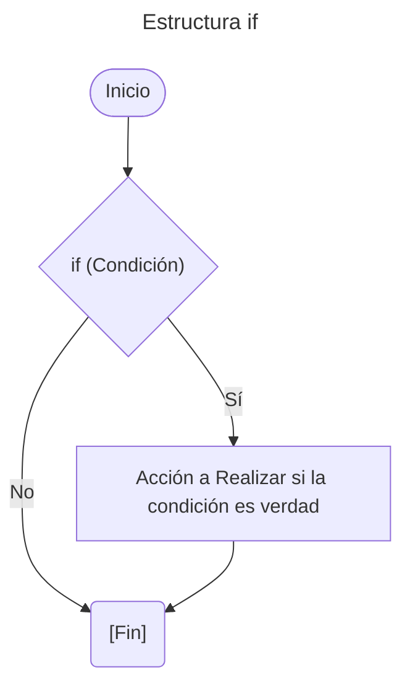
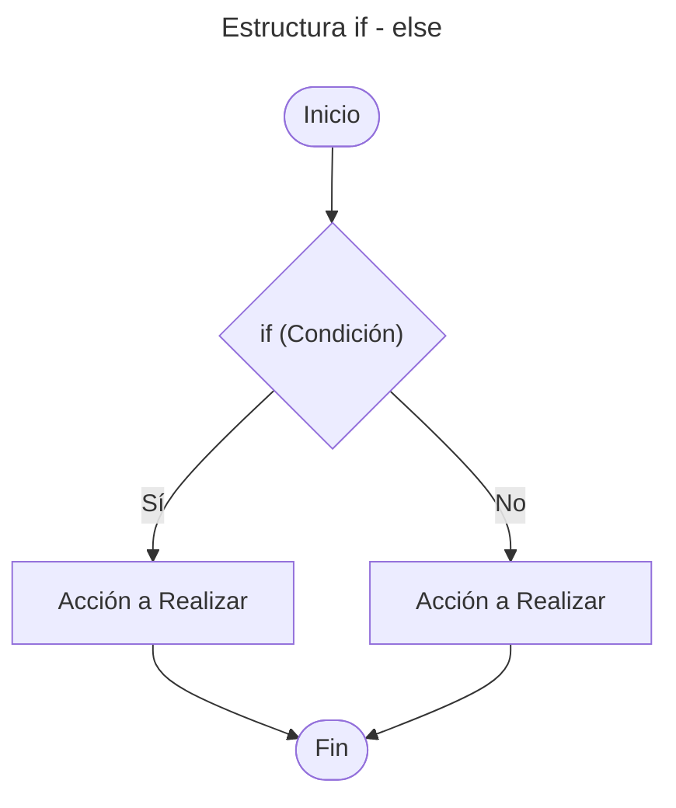
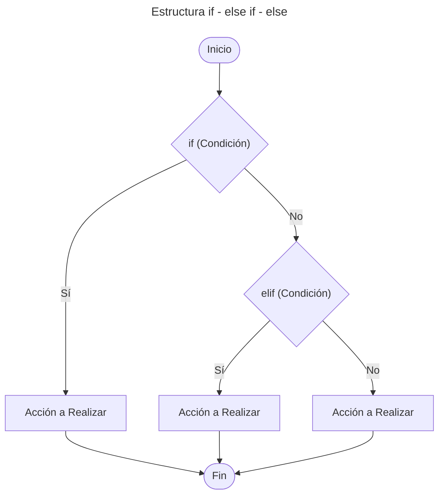
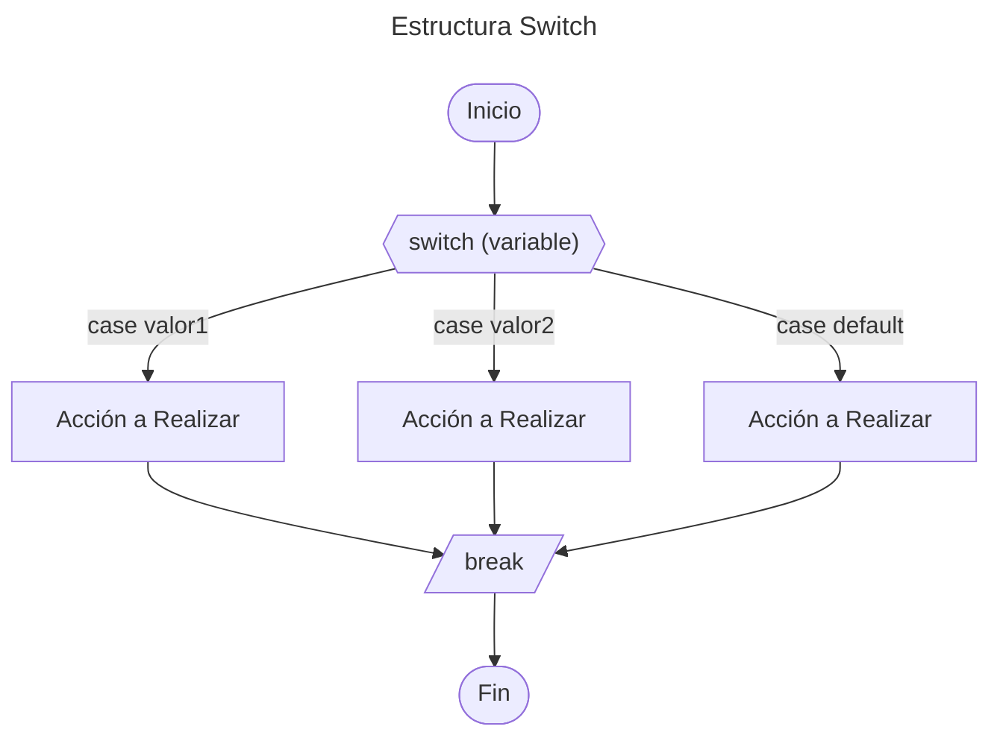

# 5. Estructuras de Control

Nos permite controlar el flujo de ejecución de un programa.

---

## Tabla de Contenido

- [5. Estructuras de Control](#5-estructuras-de-control)
  - [Tabla de Contenido](#tabla-de-contenido)
  - [Estructuras Condicionales](#estructuras-condicionales)
    - [Estructura `if`](#estructura-if)
    - [Estructura `if-else`](#estructura-if-else)
    - [Estructura `if-else if-else`](#estructura-if-else-if-else)
    - [Estructura Switch](#estructura-switch)
    - [Operador Condicional](#operador-condicional)
  - [Ejemplo Practico](#ejemplo-practico)

---

## Estructuras Condicionales

Permite ejecutar diferentes bloques de código según se  cumpla o no una determinada condición.

### Estructura `if`

Su función es realizar o no una determinada acción o sentencia, basándose en el resultado de la evaluación de una expresión booleana **(verdadero o falso)**.

***Sintaxis***

```cpp
if (Condición){
    # Bloque de código a ejecutar si la condición es verdad
}
```

**Diagrama de flujo:**



### Estructura `if-else`

La estructura selectiva doble ``if - else`` permite toma de decisión. Si la condición es **verdadera**, entonces se sigue por un camino específico y se ejecuta una acción determinada. Por otra parte, si el resultado de la evaluación es **falso**, entonces se sigue por otro camino y se realiza otra acción. En ambos casos, luego de ejecutar las acciones correspondientes, se continúa con la secuencia normal del diagrama de flujo.

***Sintaxis***

```python
if (Condición){
    # Bloque de código a ejecutar si la condición es verdad
}
else{
    # Bloque de código a ejecutar si la condición es falsa
    }
```

**Diagrama de flujo:**



### Estructura `if-else if-else`

Permite establecer una serie de condiciones al interior del programa, que ayuda a determinar qué acciones llevar a cabo dadas ciertas circunstancias. La sentencia ``else if`` se usa cuando deseamos evaluar múltiples condiciones.

***Sintaxis***

```python
if (Condición){
    # Bloque de código a ejecutar si la condición es verdad
}
elif (Condición){
    # Bloque de código a ejecutar si if es falso y la condición es verdad
}
else{
    # Bloque de código a ejecutar si todas las condiciones son falsa
}
```

**Diagrama de flujo:**



### Estructura Switch

Los condicionales Switch, son una estructura de control condicional, que permite definir múltiples casos que puede llegar a cumplir una variable, y qué acción tomar en cualquiera de estas situaciones, incluso es posible determinar qué acción llevar a cabo en caso de no cumplir ninguna de las condiciones dadas.

```cpp
switch (variable) {
    case valor1:
        // Código a ejecutar si variable es igual a value1
        break;
    case valor2:
        // Código a ejecutar si variable es igual a value2
        break;
    default:
        // Código a ejecutar si ningún caso coincide
}
```

*Componentes clave:*

- `case`: representa un posible valor de la variable
- `break`: sale de `switch` después de ejecutar un `case` (evita la ejecución sucesiva)
- `default`: `case` opcional que se ejecuta si ningún otro `case` coincide

**Diagrama de flujo:**



> [!NOTA]
> Es posible combinar varios case dejando los  casos comunes en blanco.
>
> **Ejemplo**

```cpp
switch (day) {
    case 1:
    case 2:
    case 3:
        dayName = "Start of week";
        break;
    default:
        dayName = "Invalid day";
}
```

### Operador Condicional

El operador condicional es una declaración `if-else` de una sola línea. Puede reemplazar una instrucción `if-else` simple que asigna un valor a una variable.

***Sintaxis:***

```cpp
variable = (condición) ? valor_if_true : valor_if_false;
```

**Ejemplo:**

```cpp
int age = 20;
std::string message = (age >= 18) ? "Adult" : "Minor";
```

Es posible aplicar multiples condiciones

***Sintaxis:***

```cpp
variable = (condición1) ? valor1 : (condición2) ? valor2 : valor3;
```

---

## Ejemplo Practico

1. [Estructura `if`](/01_fundamentos/05_Estructuras_de_Control/02_Estructura_if.cpp)
2. [Estructura `if - else if - else`](/01_fundamentos/05_Estructuras_de_Control/03_Estructura_if_elseif-else.cpp)
3. [Estructura `switch`](/01_fundamentos/05_Estructuras_de_Control/04-Estructura_Switch.cpp)

---

[Inicio](#5-estructuras-de-control)

---

[Tabla de contenido principal](/Tabla_Contenido.md)

---
